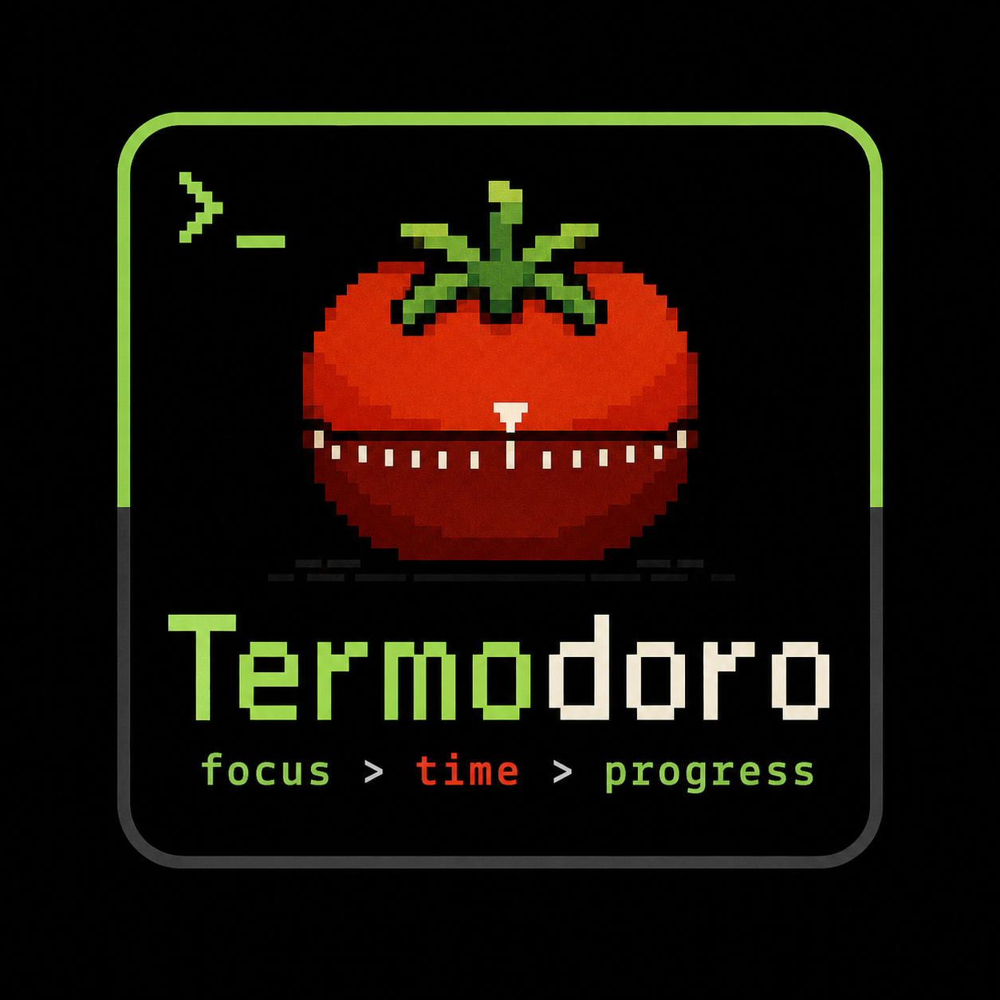

# Termodoro
A terminal Pomodoro timer for focused work sessions.


Introducing a fresh take on productivity — a minimalist terminal app for the tech-savvy professional. Keep your focus on the task without the clutter of traditional apps.

### Features
- ✅ Pomodoro timer with focus + break sessions
- ✅ 7 visual animations to choose from
- ✅ 6 sound options (including silent)
- ✅ Config presets (Classic, Short, Long, Custom)
- ✅ Desktop notifications
- ✅ Todo List (Todoist-style, priority levels P1–P3, persistent storage)
- ✅ Notes Taking (in-session scratchpad)
- ✅ Stats & Performance (focus streaks, logs, and a trailing 7-day ASCII graph)


---

## Visual Options

Visual effects make every session interesting. Choose one on the config screen.


<details open>
<summary>🌲 Tree</summary>
<br>


A random procedurally generated tree every time you start a session.
</details>

<details open>
<summary>🛶 Flow</summary>
<br>


A rower crossing the _"Time River"_.
</details>

<details open>
<summary>☕ Coffee</summary>
<br>


A coffee mug that fills up as time passes.
</details>

<details open>
<summary>🔥 Campfire</summary>
<br>

Flickering ASCII flames with a glowing log. The fire cycles through yellow, orange, and red — updates every 250ms.
</details>

<details open>
<summary>🌧️ Rain</summary>
<br>

Raindrops falling down the screen in shades of blue. A calming, ambient effect — scrolls every 100ms.
</details>

<details open>
<summary>🌅 Sunrise</summary>
<br>

A sun that rises from the horizon as your session progresses (0% = dawn red, 100% = noon yellow). Tied to timer percentage.
</details>

<details open>
<summary>🕐 BigClock</summary>
<br>

Full-screen pixel-art digit display with a live progress bar and session label. Bypasses the normal UI box for a clean, immersive view.

```
 ██████  ██████   ██   ██████  ██████
 ██  ██  ██  ██  ████  ██      ██
 ██  ██  ██  ██   ██   ████    ████
 ██████  ██████   ██       ██      ██
                  ██   ██  ██  ██  ██
                  ██   ██████  ██████
```

Digits dim when the timer is paused.
</details>


---

## How to install Termodoro

__Linux/Mac:__

```sh
git clone https://github.com/hrushik98/termodoro
cd termodoro
go build -o binary/termodoro
```

__Run:__
```sh
./binary/termodoro
```

Or with make:

```sh
make run
```

---

## Feature Guide

Termodoro is a keyboard-driven, persistent productivity center right in your terminal. Here's a complete guide to all its capabilities:

### ⚙️ 1. Configuration & Presets
When you launch Termodoro, you are greeted with the **Configuration & Presets** dashboard.
* **Presets**: Toggle quickly between:
  * **Classic Pomodoro** (25m Focus / 5m Break, "Melody" sound, "Tree" animation)
  * **Short Focus** (15m Focus / 3m Break, "High Beep" sound, "Coffee" animation)
  * **Long Focus** (50m Focus / 10m Break, "Double Beep" sound, "Flow" animation)
  * **Custom** (Manually adjusted configurations)
* **Adjustments**: Navigate using <kbd>↑</kbd>/<kbd>↓</kbd> (or <kbd>j</kbd>/<kbd>k</kbd>/<kbd>Tab</kbd>) and adjust parameters using <kbd>←</kbd>/<kbd>→</kbd> (or <kbd>h</kbd>/<kbd>l</kbd>). 
* **Audio Previews**: While adjusting the **Sound** setting, the selected sound plays instantly as a preview.

### 🔄 2. Focus & Break Session Cycle
The timer runs in a continuous loop using an automated state machine:
* When a **Focus Session** completes, it triggers your notification alert and prompts you to rest.
* Press <kbd>Space</kbd> to begin the **Break Session**.
* When the **Break Session** completes, it alerts you again and prompts you to return to work.
* Press <kbd>n</kbd> on the timer screen to stop and return to the configuration dashboard.

### 📋 3. Todoist-Style Todo List
Press <kbd>t</kbd> while the timer is running to manage your tasks without interrupting your countdown:
* **Add Task**: Press <kbd>a</kbd> to open the inline text field. Press <kbd>Enter</kbd> to save, <kbd>Esc</kbd> to cancel.
* **Priority Levels**: Highlight a task and press <kbd>1</kbd> (High - Red), <kbd>2</kbd> (Medium - Orange), <kbd>3</kbd> (Low - Blue), or <kbd>0</kbd> (None) to categorize.
* **Complete Task**: Press <kbd>Space</kbd> to toggle completion (strikethrough).
* **Delete Task**: Press <kbd>d</kbd> to delete the highlighted item.
* **Persistence**: Automatically saved to `~/.aimssh_todos.json` so you never lose your list.

### 📝 4. Scratchpad Notes
Press <kbd>o</kbd> from the Timer screen to open the session scratchpad.
* Jot down quick thoughts, code snippets, or distractions.
* Persists in memory so you can hop between the timer, todo list, and notes freely.
* Press <kbd>Ctrl+B</kbd> to return to your running timer.

### 📊 5. Focus Stats & History
Press <kbd>Shift+T</kbd> (Timer view) or <kbd>Ctrl+T</kbd> (Config view) to view your performance dashboard:
* **Metrics**: Track your current **consecutive day focus streak**, **total focus hours/minutes**, **total sessions**, and **today's logs**.
* **Visual Graph**: View an ASCII bar chart of your focus minutes logged over the last 7 days.
* **Persistence**: Every completed focus session is saved locally in `~/.aimssh/stats.json`.

---

## Controls

### Configuration Controls
* <kbd>↑</kbd> / <kbd>↓</kbd> (or <kbd>j</kbd> / <kbd>k</kbd> / <kbd>Tab</kbd>) — Navigate configuration rows
* <kbd>←</kbd> / <kbd>→</kbd> (or <kbd>h</kbd> / <kbd>l</kbd>) — Adjust setting values / change presets
* <kbd>Ctrl+T</kbd> — Open focus statistics dashboard
* <kbd>Enter</kbd> — Start the Focus Session

### Timer Controls
* <kbd>Space</kbd> / <kbd>s</kbd> — Pause / Resume timer (or start Break/Focus when session ends)
* <kbd>r</kbd> — Reset current timer session
* <kbd>n</kbd> — New session (return to configuration screen)
* <kbd>t</kbd> — Open Todo List
* <kbd>o</kbd> — Open Notes Scratchpad
* <kbd>Shift+T</kbd> — Open focus statistics dashboard
* <kbd>q</kbd> / <kbd>Ctrl+C</kbd> — Quit Termodoro

### Todo List Controls
* <kbd>a</kbd> — Add new task (Press <kbd>Enter</kbd> to save, <kbd>Esc</kbd> to cancel)
* <kbd>Space</kbd> — Toggle task completion
* <kbd>d</kbd> — Delete selected task
* <kbd>1</kbd> / <kbd>2</kbd> / <kbd>3</kbd> — Set P1 (red), P2 (orange), or P3 (blue) priorities
* <kbd>0</kbd> — Clear priority
* <kbd>↑</kbd> / <kbd>↓</kbd> (or <kbd>j</kbd> / <kbd>k</kbd>) — Navigate tasks
* <kbd>Ctrl+B</kbd> — Return to timer

### Notes & Stats Controls
* <kbd>Ctrl+B</kbd> — Return to previous view
* <kbd>Ctrl+C</kbd> — Quit

---

### Credits

* **Fork Author & Maintainer**: [Hrushik Reddy](https://github.com/hrushik98)
* **Original Project**: Forked from [aimssh](https://github.com/sairash/aimssh) by [Sairash Gautam](https://sairashgautam.com.np).

