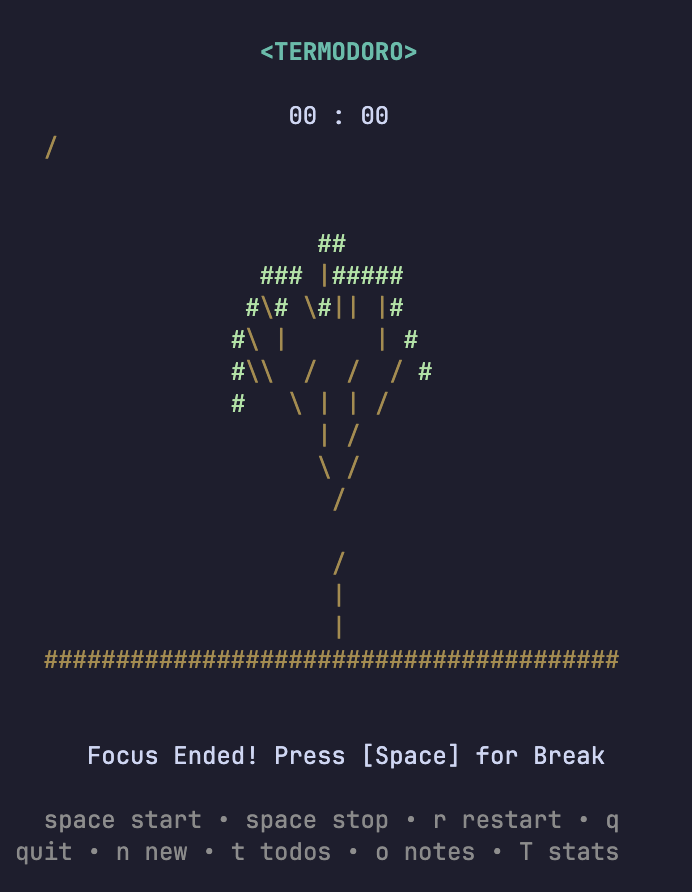
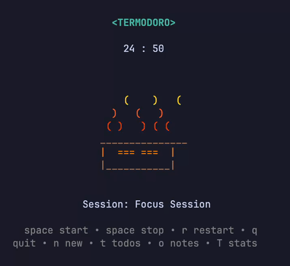
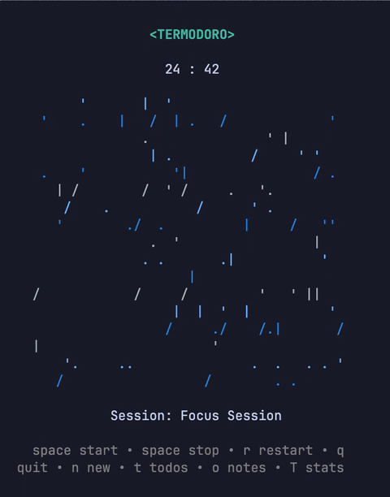
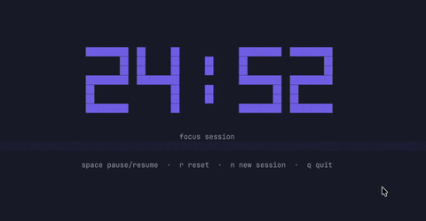

# Termodoro
A minimalist terminal Pomodoro timer for focused work sessions.



### Features
- ✅ Pomodoro timer with focus + break sessions
- ✅ 6 visual animations to choose from
- ✅ 6 sound options (including silent)
- ✅ Config presets (Classic, Short, Long, Custom)
- ✅ Desktop notifications
- ✅ Todo list (priority levels P1–P3, persistent)
- ✅ In-session notes scratchpad
- ✅ Stats dashboard (focus streaks, logs, 7-day graph)

---

## Installation

### macOS — Homebrew
```sh
brew install --cask hrushik98/tap/termodoro
```

### Windows — Scoop
```sh
scoop bucket add hrushik98 https://github.com/hrushik98/scoop-bucket
scoop install termodoro
```

### Linux
Download the `.deb`, `.rpm`, or `.apk` from the [latest release](https://github.com/hrushik98/termodoro/releases/latest), then:
```sh
sudo dpkg -i termodoro_*_linux_amd64.deb              # Debian / Ubuntu
sudo rpm -i termodoro_*_linux_amd64.rpm               # Fedora / RHEL
sudo apk add --allow-untrusted termodoro_*_linux_amd64.apk  # Alpine
```
Or grab a standalone binary for your platform from the [releases page](https://github.com/hrushik98/termodoro/releases/latest).

### Build from source
```sh
git clone https://github.com/hrushik98/termodoro
cd termodoro
make run
```

Then just run `termodoro`.

---

## Visual Options

Pick a visual effect on the config screen to make every session interesting.

<details open>
<summary>🌲 Tree</summary>
<br>


A procedurally generated tree, new every session.
</details>

<details open>
<summary>🛶 Flow</summary>
<br>


A rower crossing the _"Time River"_.
</details>

<details open>
<summary>☕ Coffee</summary>
<br>


A coffee mug that fills up as time passes.
</details>

<details>
<summary>🔥 Campfire</summary>
<br>



Flickering ASCII flames with a glowing log, cycling through yellow, orange, and red.
</details>

<details>
<summary>🌧️ Rain</summary>
<br>



Raindrops falling down the screen in calming shades of blue.
</details>

<details>
<summary>🕐 BigClock</summary>
<br>



Full-screen pixel-art digits with a live progress bar. Digits dim when paused.
</details>

---

## Feature Guide

- **Configuration & Presets** — Launch into a dashboard to pick a preset (Classic 25/5, Short 15/3, Long 50/10, or Custom) and tune focus/break length, sound, and animation. Sounds preview instantly as you adjust them.
- **Focus & Break Cycle** — The timer loops automatically: a finished focus session alerts you and prompts a break (<kbd>Space</kbd> to start), and vice versa.
- **Todo List** — Press <kbd>t</kbd> while the timer runs to manage tasks with P1–P3 priorities. Saved to `~/.aimssh_todos.json`.
- **Notes Scratchpad** — Press <kbd>o</kbd> to jot down quick thoughts without leaving your session.
- **Stats & History** — Press <kbd>Shift+T</kbd> (timer) or <kbd>Ctrl+T</kbd> (config) for your focus streak, totals, today's logs, and a 7-day graph. Saved to `~/.aimssh/stats.json`.

---

## Controls

### Configuration
* <kbd>↑</kbd> / <kbd>↓</kbd> (or <kbd>j</kbd> / <kbd>k</kbd> / <kbd>Tab</kbd>) — Navigate rows
* <kbd>←</kbd> / <kbd>→</kbd> (or <kbd>h</kbd> / <kbd>l</kbd>) — Adjust values / change presets
* <kbd>Ctrl+T</kbd> — Open stats dashboard
* <kbd>Enter</kbd> — Start the focus session

### Timer
* <kbd>Space</kbd> / <kbd>s</kbd> — Pause / resume (or start the next session)
* <kbd>r</kbd> — Reset current session
* <kbd>n</kbd> — New session (back to config)
* <kbd>t</kbd> — Todo list &nbsp;·&nbsp; <kbd>o</kbd> — Notes &nbsp;·&nbsp; <kbd>Shift+T</kbd> — Stats
* <kbd>q</kbd> / <kbd>Ctrl+C</kbd> — Quit

### Todo List
* <kbd>a</kbd> — Add task (<kbd>Enter</kbd> save, <kbd>Esc</kbd> cancel)
* <kbd>Space</kbd> — Toggle completion &nbsp;·&nbsp; <kbd>d</kbd> — Delete
* <kbd>1</kbd> / <kbd>2</kbd> / <kbd>3</kbd> — Set P1 / P2 / P3 &nbsp;·&nbsp; <kbd>0</kbd> — Clear priority
* <kbd>↑</kbd> / <kbd>↓</kbd> (or <kbd>j</kbd> / <kbd>k</kbd>) — Navigate &nbsp;·&nbsp; <kbd>Ctrl+B</kbd> — Back to timer

### Notes & Stats
* <kbd>Ctrl+B</kbd> — Return to previous view &nbsp;·&nbsp; <kbd>Ctrl+C</kbd> — Quit

---

### Credits

* **Fork Author & Maintainer**: [Hrushik Reddy](https://github.com/hrushik98)
* **Original Project**: Forked from [aimssh](https://github.com/sairash/aimssh) by [Sairash Gautam](https://sairashgautam.com.np).
